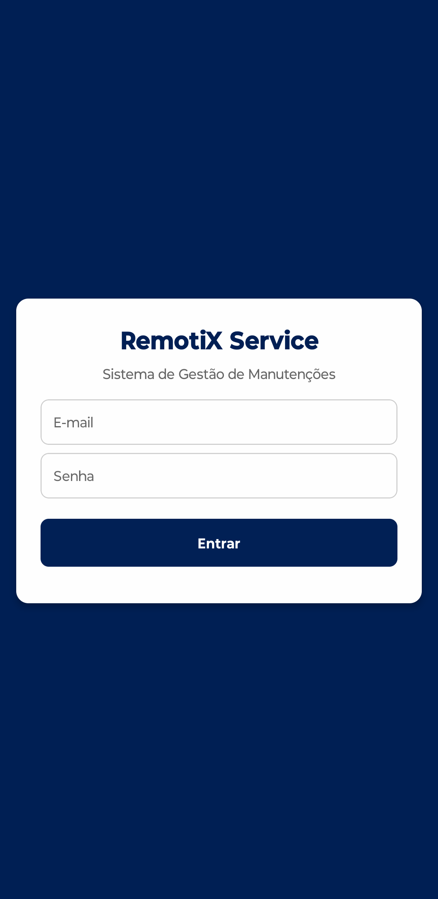
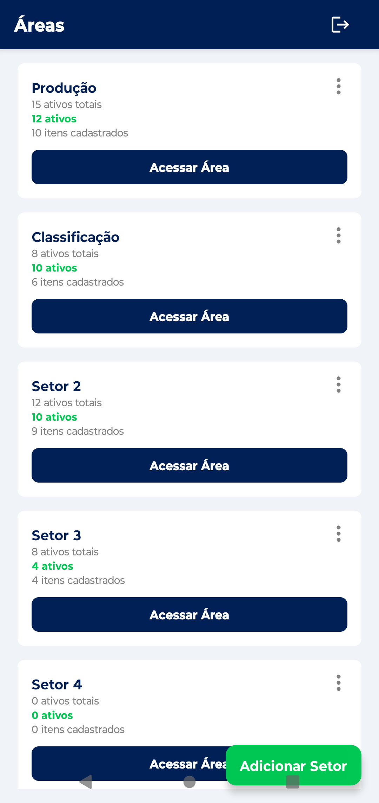
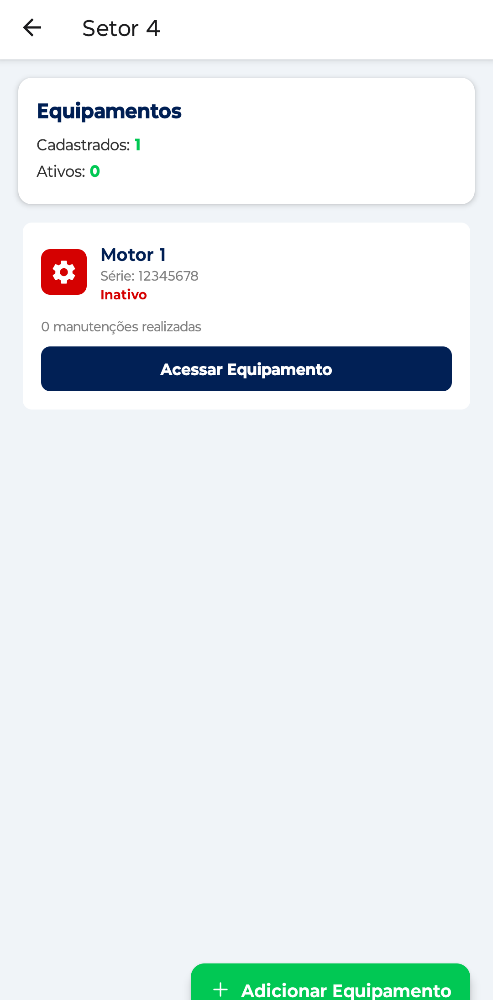
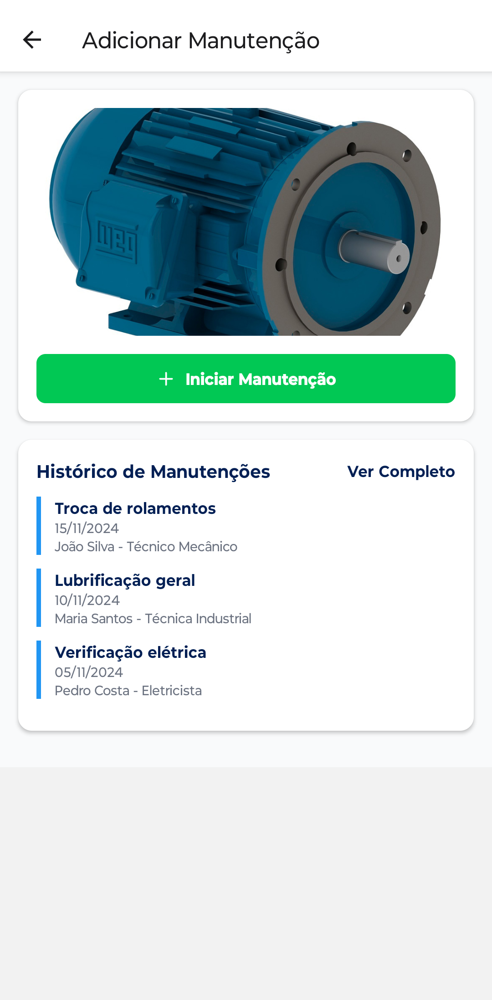
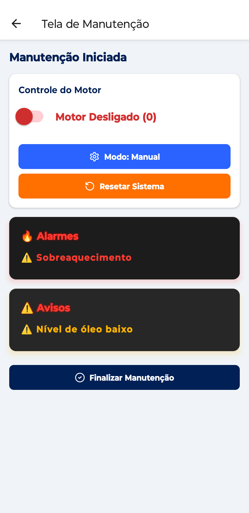

# ☁️ RemotiX service - React Native App

A ideia consiste no desenvolvimento de um app mobile que, integrado aos equipamentos da empresa, consiga monitorar, controlar e auditorar equipamentos remotamente.
A finalidade é que, além de manter a segurança, facilite a manutenção de equipamentos e gere um overview para a equipe de manutenção.

## 🛠️ Ferramentas Utilizadas

- 📒 [JavaScript](https://developer.mozilla.org/pt-BR/docs/Learn_web_development/Core/Scripting/What_is_JavaScript)  
  Linguagem de programação utilizada.

- ⚛️ [React Native](https://reactnative.dev/)  
  Biblioteca principal para desenvolvimento do aplicativo móvel.

- 🚀 [Expo](https://expo.dev/)  
  Framework e conjunto de ferramentas para facilitar o desenvolvimento e testes em React Native.

- 🧭 [React Navigation](https://reactnavigation.org/)  
  Biblioteca de navegação entre telas, usada para gerenciar pilhas de navegação (`@react-navigation/native` e `native-stack`).

- 🖼️ [react-native-svg](https://github.com/software-mansion/react-native-svg)  
  Suporte para renderização de SVGs, útil para gráficos e ícones vetoriais.

- 🎨 [lucide-react-native](https://lucide.dev/)  
  Conjunto de ícones baseados em SVG.

- ➕ [react-native-floating-action](https://github.com/santomegonzalo/react-native-floating-action)  
  Componente de botão flutuante (Floating Action Button) com múltiplas ações.

- 🔥 [Firebase](https://firebase.google.com/?hl=pt-br)  
  Utilizado para autenticação e armazenamento.

## ⚙️ Como Funciona?

### 🔐 Login

O acesso é feito via login com autenticação do Firebase, garantindo segurança e personalização de acordo com o cargo e permissões do usuário.



### 🏭 Áreas da Empresa

Após o login, o usuário visualiza as áreas operacionais da empresa. Cada área exibe um resumo dos equipamentos associados, incluindo:

* Total de equipamentos

* Equipamentos ativos

* Equipamentos cadastrados

Essa segmentação facilita o gerenciamento por setor.



### 🔩 Equipamentos

Dentro de cada área, é possível visualizar os equipamentos cadastrados, com informações como:

* Nome

* Série

* Status atual

* Numero de manutenções realizadas

Os dados ficam disponíveis mesmo offline, graças ao cache local. Novos cadastros feitos offline são sincronizados automaticamente com o Firebase quando o dispositivo voltar a ter conexão.



### 📑 Registros de Manutenção

Cada equipamento pode ter manutenções registradas com:

* Manutenção realizada

* Data de finalização

* Nome e cargo do técnico

Esses registros também funcionam com sincronização offline/online e são vinculados ao usuário autenticado.



### 🔧 Tela de Manutenção

Ao iniciar uma manutenção é possivel:

* Ligar/Desligar o motor

* Alternar o seu modo

* Resetar o sistema

* Ter acesso aos problemas do motor atraves de alarmes e avisos



### 📷 Leitura de QR Code

Há suporte para leitura de QR Code, permitindo que o técnico escaneie o código em um equipamento e seja redirecionado diretamente ao equipamento.

[tela de qr code]

## 📁 Estrutura do Projeto

```
.
├── App.js                      # Componente principal da aplicação
├── index.js                    # Ponto de entrada do app
├── app.json                    # Configurações do Expo
├── metro.config.js             # Configuração do Metro bundler
├── package.json                # Dependências e scripts do projeto
├── package-lock.json           # Registro exato das dependências
├── .gitignore                  # Arquivos/pastas ignoradas pelo Git
├── estrutura.txt               # Mapeamento da estrutura do projeto
├── README.md                   # Documentação principal do projeto

├── .expo                       # Arquivos internos do Expo
│   ├── devices.json
│   └── README.md

├── AreaDetails                 # Telas e lógica de detalhes da área
│   ├── AddEquipament.js        # Componente para adicionar equipamento
│   └── AreaDetails.js          # Tela com detalhes da área

├── Areas                       # Telas e lógica dos setores
│   ├── AddSector.js            # Tela para adicionar setor
│   ├── AreasScreen.js          # Visualização dos setores
│   └── SectorContext.js        # Contexto global dos setores

├── Equipament                  # Componentes relacionados a equipamentos
│   ├── Equipament.js           # Lista de equipamentos
│   └── StartMaintenance.js     # Início do processo de manutenção

├── Login                       # Componente de login
│   └── LoginForm.js            # Formulário de autenticação

├── assets                      # Recursos visuais e estáticos
│   ├── adaptive-icon.png
│   ├── favicon.png
│   ├── icon.png
│   └── splash-icon.png

├── services                    # Integração com serviços externos
│   └── firebaseConfig.js       # Configuração e inicialização do Firebase

├── Utils                       # Funções auxiliares e botões flutuantes
│   ├── floatButton.js          # Ações do botão flutuante
│   └── Formatters.js           # Funções de formatação (ex: capitalização)

└── ValidaçõesTeste             # Autenticação e validação mock
    ├── AuthContext.js          # Contexto de autenticação com usuários fixos
    ├── ValidateCaracter.js     # Validação de campos simples
    └── ValidateInput.js        # Validação e sanitização do formulário
```

## 🛎️ Como executar

1. Tenha o Node.js e o Expo CLI instalados, caso não tenha faça o download do node.js e execute o comando abaixo no terminal:

* [Node.js](https://nodejs.org/pt)

* Expo CLI
```
npm install -g expo-cli
```

2. Clone o repositório:
```
git clone https://github.com/RodriMec/RemotiX.git
cd RemotiX
```

3. Instale as dependências:
```
npm install
```

4. Inicie o projeto:
```
npx expo start
```

## 📋 Avaliação do nosso cliente

**Cliente:**

AGPR5 - Automação e Sistemas focada em soluções inteligentes para o agronegócio.
Localizada na Rodovia Antônio Darós, 1555, São João em Cricíuma.

**Responsavel:**

Uilians Cardoso, supervisor de Desenvolvimento de Automação. e Posta em Marcha.

**Avaliação:**

[Video e fotos]

## ✍️ Créditos

Este projeto foi desenvolvido como avaliação final da disciplina de projeto integrador de desenvolvimento mobile dos cursos de Engenharia de Software e Engenharia da Computação na UniSATC.

**Integrantes:**

* nome1
* nome2
* nome3
* nome4
* nome5

